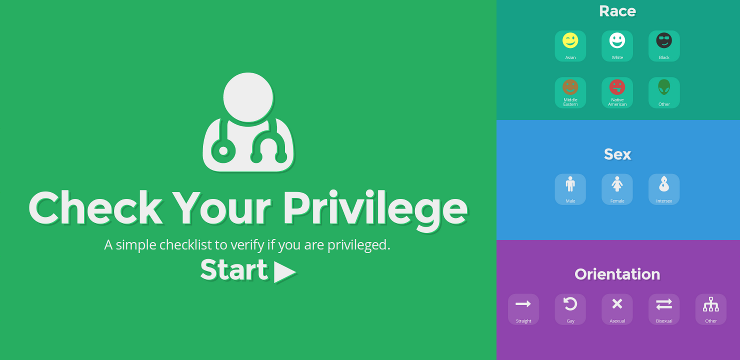

# Check Your Privilege

A simple checklist to verify if you are privileged. [Take it here.][site]

## About

This is a Node package which produces a static web site. It uses
[Reveal.js][reveal] for the slides.

## Build

Install `npm`. Get the requirements with:

    npm install

Install `grunt` and build the development version with:

    grunt

For production use:

    grunt production

this also minifies everything.

## Licence

MIT

[site]: http://nechifor.net/check-your-privilege
[reveal]: https://github.com/hakimel/reveal.js
